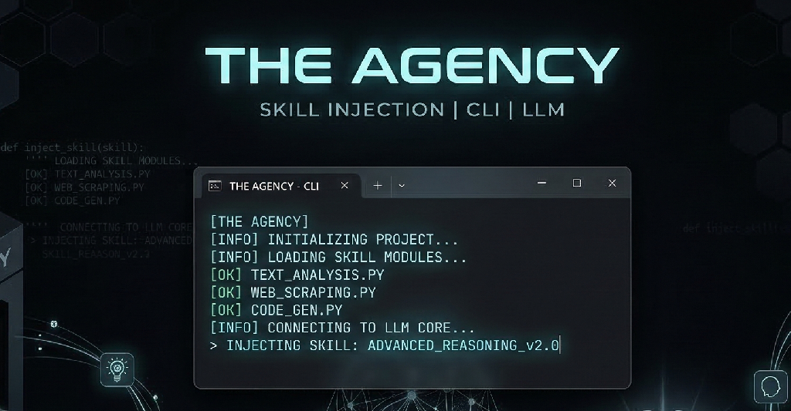

<div align="center">
  
</div>

# The Agency

[](https://badge.fury.io/py/the-agency-cli)
[](https://opensource.org/licenses/MIT)

## The Virtual IT Team in Your Pocket 🏢

"The Agency" is an open-source framework that models a complete Enterprise Software Development Organization using specialized AI Personas ([Skills](skills/)).

## ⚖️ Why The Agency? (vs. CrewAI, AutoGen, LangGraph)

Unlike traditional agent orchestration frameworks that require you to write hundreds of lines of complex Python code to define state variables, execution graphs, and LLM API hooks, **The Agency** is purely contextual.

- **Zero Code Orchestration:** The Agency provides the missing *Domain Knowledge, Organizational Chart, and Standard Operating Procedures (SOPs)* as modular logic files. You don't need to write connection code.
- **Bring Your Own Editor:** Instead of running a headless python script, you inject The Agency's Personas directly into the powerful AI tools you already use every day (Cursor, Roo Code, Copilot Workspaces, Gemini CLI, Aider).
- **Practical Software Engineering:** Other frameworks give you a generic sandbox. The Agency gives you a heavily researched, production-proven IT department ranging from a `project_manager` and `cmo_analyst` to a `chief_information_security_officer` and `sre_cloud_architect`.

*You don't need another orchestration engine. You just need a better team.*

Simply inject these personas into your favorite AI tool and watch the Virtual IT Team design, develop, secure, test, and market your application.

## 🛡️ Core Value: Prompt Poisoning Defense
As an open-source framework driven purely by contextual markdown, **The Agency** recognizes that "Prompt Injection" and "Data Poisoning" are the largest unmitigated threats to autonomous agent ecosystems.

We maintain a strict **Chain of Trust** for all external contributions. 
Because malicious actors could attempt to submit Pull Requests containing jailbreaks or data exfiltration commands hidden inside a Persona's System Prompt (`SKILL.md`), this repository treats prompt security as a first-class citizen. All incoming PRs are strictly audited, ensuring that an enterprise using The Agency is never compromised by a poisoned virtual employee. 

---

## 👥 The Organization Chart

The Virtual IT Team comprises specialized "Skills", mapped precisely to a modern tech enterprise:

- **Management:** `project_manager`, `historian`, `workspace_manager`
- **Architecture:** `solution_architect`, `cmo_analyst` (Digital Twin Owner), `sre_cloud_architect`
- **Development:** `backend_developer`, `frontend_developer`, `coder`
- **Design:** `ux_ui_designer`
- **Data Engineering:** `relational_dba`, `graph_database_architect`, `data_scientist`
- **Quality Assurance:** `chief_test_officer`, `qa_automation_engineer`, `test_engineer`, `e2e_journey_tester`, `test_data_manager`, `ui_qa_engineer`
- **Security:** `chief_information_security_officer`, `application_security_engineer`, `security_operations_analyst`
- **Deployment:** `ssdlc_manager`
- **Management & Marketing:** `head_of_marketing`, `product_marketing_manager`, `content_copywriter`, `technical_writer`
- **Support & AI Ops:** `customer_support_triage`, `prompt_engineer`, `makefile_orchestrator`
- **Meta-Skills (The Creators):** `skill_creator` (Organizational Architect), `tool_smith` (Internal Tooling)

*(Read each `SKILL.md` inside the `skills/` folder to review the specific heuristics and constraints of that role).*

---

## 🚀 How to Use "The Agency"

Because The Agency defines *logic* and *processes* rather than hard-coded python scripts, you can use it conceptually within any environment.

### 1. The Global Agency CLI (Recommended)
The most powerful way to use "The Agency" is to install it globally on your system path. This allows you to spawn any persona directly into whichever project directory you are currently working in.

Because "The Agency" is written in Python, the recommended way to install it globally without breaking your system packages is via `pipx`.

```bash
# Install the CLI globally in an isolated environment
pipx install the-agency-cli

# Navigate to any of your completely separate projects
cd /my/super/secret/startup/

# Launch the interactive CLI right there
agency
```

The CLI will guide you through:
- **Initialize & Configure:** Automatically scans for AI assistants — Cursor (`.cursorrules`), Gemini CLI (`.gemini`/`GEMINI.md`), Roo Code / Cline (`.clinerules`), Claude Code (`CLAUDE.md`), Aider (`.aider.conf.yml`), GitHub Copilot (`.github/` directory or `copilot-instructions.md`), and Windsurf (`.windsurfrules`). It installs the Agency skills into your `.agency/` folder and injects a full skill directory with workflow guidance into your AI tool's project memory file so it can immediately navigate and employ the Virtual IT Team.
- **Browse Skills:** View the organizational chart and understand what every department does.
- **Run Skill:** Choose a specific skill, paste a task, and the agent will immediately context-switch into your codebase to start working.

### 2. In Any AI Coding Tool (Cursor, Roo Code, Copilot, Claude, Gemini…)
After running `agency init`, your tool's config file already contains the full skill directory.
Simply ask your assistant: *"Act as the `frontend_developer` skill and complete this task."*
It will read `.agency/skills/frontend_developer/SKILL.md` and adopt the persona automatically.

### 3. Pure Makefiles & Terminal Piping
If you prefer raw execution, you can completely ignore `.agency.py` and run sequential generation using the `Makefile` pattern.

**See the example `Makefile` in the root directory for a proof-of-concept pipeline.**

```bash
# Example: Generate an application schema using a local 8B model
make build-schema 
```

### 4. Supercharging Skills with Tools
While skills have "Brains", they need "Hands" to affect the local machine. By installing common CLI tools globally on your terminal (e.g., `semgrep`, `docker`, `playwright`), you empower the agents to use those tools automatically via `run_command` capabilities.

**[Read the Recommended Tools Architecture](docs/architecture/recommended_tools.md)** to see which open-source CLIs pair best with which Virtual Employee. If a tool you need doesn't exist, spawn the `tool_smith` meta-skill to write a custom wrapper!

---

## 📦 Integrating into an Existing Project

If you are not starting from scratch, you can easily drop "The Agency" into a mature, existing repository.

**1. Call `agency init` (or just `agency`) and select "Initialize"**
The init step does two things:
- Copies the entire skills library into `.agency/skills/` in your project.
- Injects a full skill directory + workflow guide into your AI tool's config file (`.cursorrules`, `CLAUDE.md`, `.github/copilot-instructions.md`, `GEMINI.md`, etc.) so the assistant immediately knows how to navigate and use the Virtual IT Team without any extra prompting.

**2. Initialize the "Digital Twin" (The Most Important Step)**
AI agents hallucinate when they don't know your existing architecture. Before asking the Agency to write new code for your existing app, you must map your current state. From the `agency` initialization menu, select **"Map Digital Twin"**:
*   The `historian` reads your files to summarize the project's purpose.
*   The `solution_architect` maps the `src/` hierarchy to build a system architecture.
*   The `cmo_analyst` aggregates this into a master "Digital Twin" state document at `docs/cmo_state.md`.

**3. Resume Normal Operations**
Once properly mapped and configured, your native AI editor (like Cursor or Gemini) naturally understands your new virtual employees and the structure of your application. Ask your IDE directly: *"Tell the `backend_developer` to build a new auth route according to the architecture."*

---

## 🏗️ The Project Lifecycle

If you elect to use the full agency, follow the routing lifecycle governed by the `project_manager`:

1. **Discovery:** `cmo_analyst` checks the system's "Digital Twin" constraints (`docs/`).
2. **Design Blueprint:** `ux_ui_designer` maps the wireframes; `prompt_engineer` maps the LLM context flow.
3. **Architecture:** `solution_architect` defines the data models and component structure.
4. **Security Check:** `ciso` reviews the architecture for vulnerabilities. *(Must pass before coding).*
5. **Implementation:** Specialized `backend_developer` and `frontend_developer` write the code.
6. **Testing:** `chief_test_officer` coordinates unit, integration, and E2E tests.
7. **Deployment:** `sre_cloud_architect` dictates topology, and `ssdlc_manager` routes it to production.
8. **Launch:** The Marketing division generates go-to-market copy while the `technical_writer` builds the public APIs.

---

## 📜 Legacy Assets
Older, hard-coded Python SDK variants of this agentic framework have been archived in the `legacy/` folder for historical reference. The future of The Agency is agnostic, prompt-driven markdown injected into powerful local or cloud execution layers.

## 🤝 Contributing
Contributions are what make the open source community such an amazing place to learn, inspire, and create. Any contributions you make are **greatly appreciated**.

Want to add a new role to the IT Team? 
1. Copy an existing `SKILL.md` inside `skills/`.
2. Define their Core Responsibilities and Workflow Integration in the markdown.
3. Submit a Pull Request.

## 🐛 Issues and Support
If you encounter any bugs, have feature requests, or need help integrating The Agency into your workflow, please [open an issue](../../issues) on GitHub.

## 📄 License
Distributed under the MIT License. See `LICENSE` for more information.
